# Unity Workshop - Cambridge GameGig 2019

This workshop introduces the reader to a number of core workflows in Unity, and strings them together to make a very basic game.

The steps are documented below in this readme.

There are introductory slides in the */Slides* folder.

The final project resides in the */UnityWorkshopGame* folder.

Have fun!

# Prerequisites

Download and install Unity3D from the website: https://unity3d.com/get-unity/download . Create an Individual / Free account if you don't have one already.

A code editor is required. I usually fallback to using Visual Studio for its advanced coding functionality. But it's a bit heavyweight and some people use other editors like VSCode. The editor can be configured in the Unity Editor Preferences.

An open mind and willingness to learn!

# Plan

As time is very limited and there is a lot to learn, we'll aim to do something simple which will cover a few of the main Unity workflows. We'll make a simple mini-game which resembles an infinite runner, where they player must jump over an obstacle without touching it.

# Stage 1 - Set up environment

This will be the static scene that the gameplay takes place in.

We're going to make the following. The brown object is the floor. The yellow object is an obstacle.

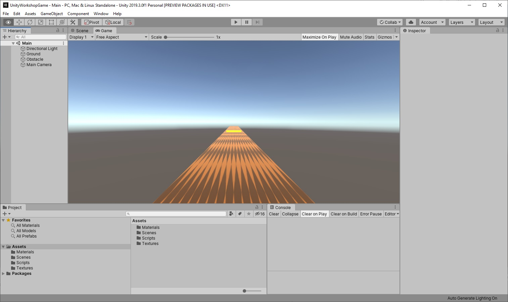

Add a cube to the scene for a floor:

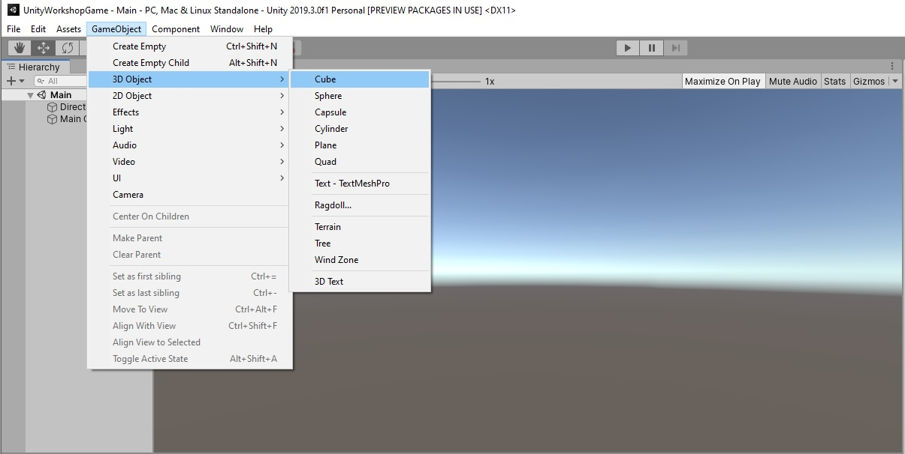

Ensure the cube is selected in the *Scene* view, then in the Inspector window, set the GameObject name and transform to something like the following.

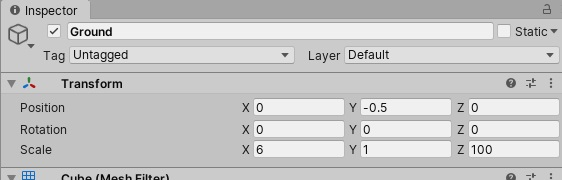

I decided that the top surface of the cube should be at y=0, hence the y scale of 1.0 and y offset of -0.5.

Lets change the colour of the Ground. In the *Project* view, create a new material asset in a Materials folder using the right-click menu:

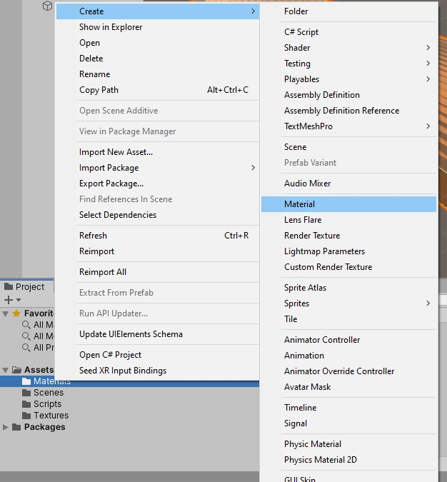

Select the new material and in the *Inspector*, set the Albedo (colour) to whatever colour you like. Alternatively, if you want to use a texture, drag the texture into the Project view to import it, and then use the picker to the left of the word Albedo to select it.

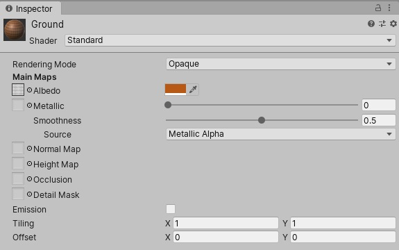

Finally position the camera at one end of the Ground by changing the transform of *Main Camera* in the *Inspector* window:

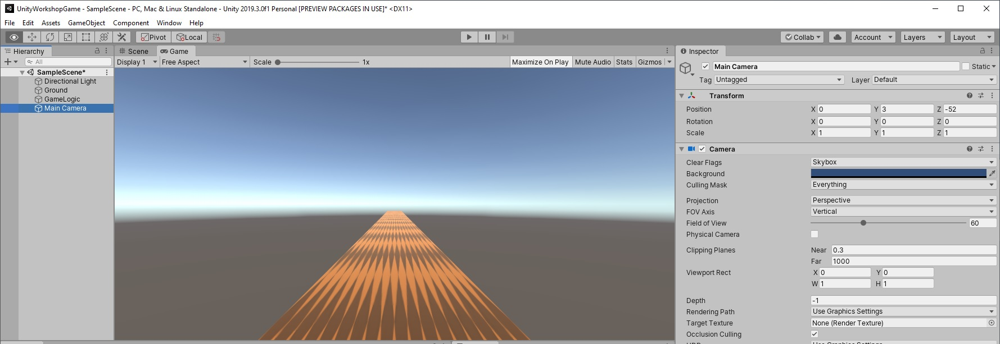

# Stage 2 - Set up the player

We'll create a gameobject that represents the player. It will move forward at a constant speed, and jump when the player presses the spacebar.

## Game object setup

There are assets available from Unity for bipeds. In our example we'll simply use a Capsule as a placeholder object to represent the player. Using fast representations like this is common in gamejams. I created a new Capsule using the menu as shown, and placed it at the shown position in the scene, and gave it a blue colour:

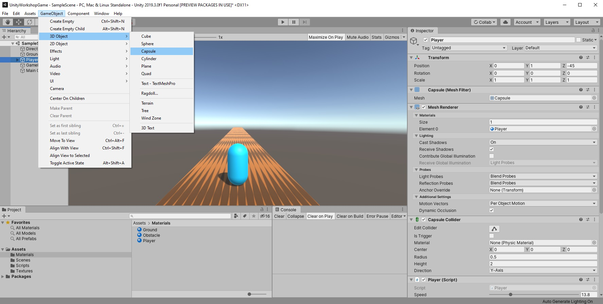

The player motion will come from a rigidbody. A rigidbody is an object which interacts with the physics world and collides with physics collision in the screen (this collision comes from *Collider* components which are added to cubes and capsules by default).

With the player gameobject selected, scroll to the bottom of the *Inspector* window and click the Add Component button, and select Rigidbody as shown:

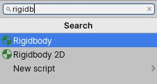

This will make a new section appear in the *Inspector* window for the rigidbody:

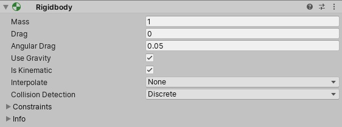

The documentation will have details on what these properties do and we won't go through them in detail here.

However a notable option we have selected is the *Is Kinematic* option. This will disable the dynamic physics simulation on this object. It won't roll around by itself, or fall under gravity. One might ask why we use a rigidbody component? For one critical reason - our obstacle that the player needs to jump over will be a *Trigger* that will fire an event on overlaps, and this overlap detection is driven through the physics engine. Our player must have a rigidbody attached so that it is registered with the physics engine, without this no overlap will be detected.


## Behaviour

Our next task is to make the capsule move. Behaviours are authored through C# classes that inherit from *MonoBehaviour* which is the base class for behaviour scripts.

We're going to add a behaviour for the player, which we'll call simply *Player*.

Select the Player gameobject, scroll to the bottom of the *Inspector*, select Add Component, type the name *Player*, and select *New Script* and confirm.

You should see a component called *Player (Script)* appear on the Player gameobject in the Inspector, with a grayed out Script reference with the script name *Player* in the box. Single click the name of the script and it will highlight the referenced script in the *Project* window. Double click it and it should launch a script editor to view the script.

The new script should be based on a simple template that looks follows:

```
using System.Collections;
using System.Collections.Generic;
using UnityEngine;

public class Player : MonoBehaviour
{
    // Start is called before the first frame update
    void Start()
    {
        
    }

    // Update is called once per frame
    void Update()
    {
        
    }
}
```

The function names *Start* and *Update* are special names. Unity will detect these and call *Start* just before the first time the behaviour starts updating, and will call *Update* every frame. There are many special functions that you can add, see the documentation for more detail: https://docs.unity3d.com/ScriptReference/MonoBehaviour.html


Let's start by adding some member variables to the top of the class. Add the following public variables:

```
    [Range(0f, 60f)]
    public float _speed = 14f;

    public Vector3 _jumpInitialVelocity = Vector3.up * 10f;
```

Speed will give the forward motion speed of hte character, and jump initial velocity will define the upwards velocity given to the character at the start of the jump.

Save the file and switch back to Unity. Unity will detect the script has changed, and recompile. After recompile the properties should appear in the Inspector:

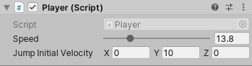

Any public variables will be detected by Unity and will be reflected in the inspector. The way they appear can be changed with Attributes - the *Range* attribute sets up the slider, for instance. The values of this data will be saved when you save the scene.

We now add some logic to the player. We add a simple state machine. By default the state is *NotJumping*. It will switch to *Jumping* when the player presses spacebar:

```
using UnityEngine;

public class Player : MonoBehaviour
{
    [Range(0f, 60f)]
    public float _speed = 60f;

    public Vector3 _jumpInitialVelocity = Vector3.up * 10f;

    // Make an enum for the state
    enum JumpState
    {
        NotJumping,
        Jumping,
    }
    JumpState _jumpState = JumpState.NotJumping;

    // Jump velocity - internal state, not shown in inspector
    Vector3 _velocity = Vector3.zero;

    void Update ()
    {
        transform.position += _speed * Vector3.forward * Time.deltaTime;

        switch(_jumpState)
        {
            case JumpState.NotJumping:

                // Detect if player presses spacebar and jump
                if (Input.GetKeyDown(KeyCode.Space))
                {
                    // Switch to jumping state

                    // Write a line to the log
                    Debug.Log("Started jumping");

                    // Set jump velocity
                    _velocity = _jumpInitialVelocity;

                    // Change state
                    _jumpState = JumpState.Jumping;
                }

                break;

            case JumpState.Jumping:
                // Move forward by velocity
                transform.position += _velocity * Time.deltaTime;

                // Apply gravitational force
                _velocity += Physics.gravity * Time.deltaTime;
                
                // Detect if player hits ground and stop jumping
                if(transform.position.y <= 1f)
                {
                    var pos = transform.position;
                    pos.y = 1f;
                    transform.position = pos;

                    _jumpState = JumpState.NotJumping;
                }
                break;
        }
	}
}
```

With this we should be able to play a basic version other the game (although we haven't set up the camera behaviour yet). To start the game simulation, press the Play button on the top of the Unity window:

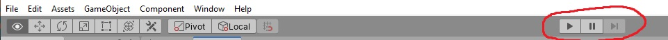

The *Game* window should appear and the player object should move forward at the set velocity. Pressing spacebar should make the player jump.

Move to the inspector window and tweak the player speed and initial jump velocity to your liking. **However, note that your changes will affect the instance of the game running in play mode, not the settings saved in the level**. For this reason, if stop play mode your settings will be discarded with the game state and it will revert back to what is saved in the level. 

The simplest way to manage this is to make changes in play mode and then write them down, and reapply the changes after stopping.

# Stage 3 - Camera behaviour

To author the camera behaviour, create a new script on the camera called *PlayerCamera*, and use the following code:

```
using System.Collections;
using System.Collections.Generic;
using UnityEngine;

public class PlayerCamera : MonoBehaviour
{
    public Transform _cameraTarget;

    public float _lerpAmount = 0.1f;

    void Update ()
    {
        transform.position = Vector3.Lerp(transform.position, _cameraTarget.position, _lerpAmount * 60.0f * Time.deltaTime);
    }
}
```

This takes a target transform to follow, and will interpolate towards it every frame. This is a simple yet powerful pattern for making a "follow" behaviour.

The multiplication by delta time is an important nuance - without this the motion of our camera will depend on the frame rate, and if there are long frames / hitches this will be visible as jitter. Multiplying by a factor of delta time means the actual frame time is compensated and the motion will be smooth.

If we switch back to the inspector and inspect the *Main Camera* gameobject, the *Player Camera* script will now have an input for the *Camera Target*, which wants a reference to a Transform for the camera to follow.

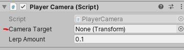

Every gameobject has a Transform component by default. So we'll create a gameobject for the camera target position and parent it to the Player, so that it moves with the player through the world.

Create a game object that represents the camera target by right clicking in the *Scene* view and selecting *Create Empty*. Rename the new object to *CameraTarget*. Then left click drag it onto the Player gameobject to parent it, and set a translation on the transform of the CameraTarget to up and behind the Player. This image shows the final configuration and transform we used:

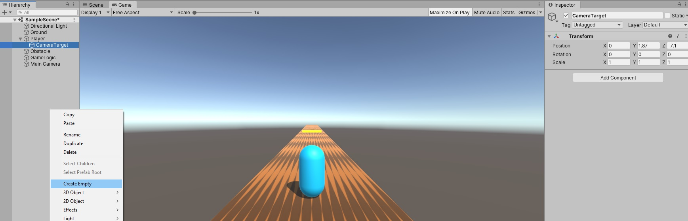

Now that a camera target has been created and parented to the Player, we can provide a reference to this target to the PlayerCamera script so that it knows the transform it should follow. To do so, select the *Main Camera* game object, make sure the *Player Camera* script is visible in the Inspector window, then left-click-drag the *CameraTarget* gameobject onto the *Camera Target* field of the script.

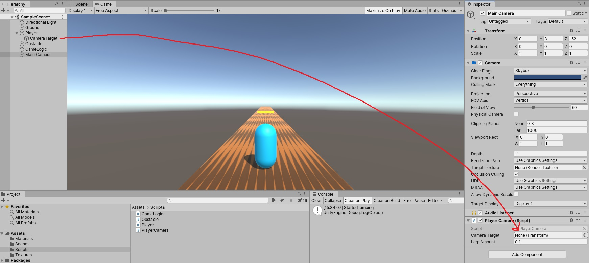

Now that the reference is set, re-enter Play mode and the camera should follow the capsule.


# Stage 4 - Set up the obstacle

Now we'll add something for the player to jump over.

Add a cube for the obstacle, with a new script called Obstacle. The setup we used for this gameobject is shown in the following. Note that on the *Collider* script the **Is Trigger** option is ticked. This means that other physics objects can overlap with this object, and we'll receive a notification when this happens which we'll use next.

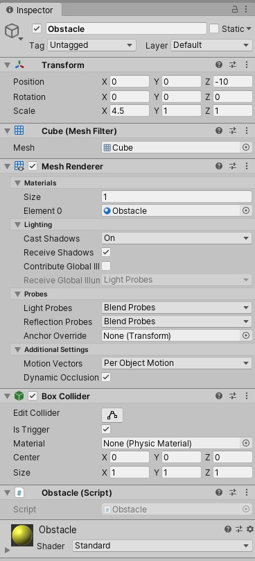

For the *Obstacle* script, one possible script would be the following:

```
using UnityEngine;

public class Obstacle : MonoBehaviour
{
    // Will be called when a rigidbody starts overlapping this object
    private void OnTriggerEnter(Collider other)
    {
        if (other.gameObject.name == "Player")
        {
            Destroy(other.gameObject);
        }
    }
}
```

*OnTriggerEnter* will be called by Unity when a collider starts overlapping with the trigger cube. The above checks if the name of the overlapping gameobject is *Player*, and if so destroys the player object. This works but is fairly crude. A better approach would be to notify some kind of game logic / manager, which we'll look at setting up next.

Experiment with the obstacle position and scale. You may also copy paste the obstacle to duplicate it.


# Stage 5 - Add some game logic

Now we have a couple of simple game mechanics, our final task will be to add some higher level logic that controls the game state.

An easy path to set this up is the *Singleton* pattern. This is a class that creates a single instance of itself at runtime, and makes this instance available to the rest of the game. This is an easy central point for logic and data to reside. There are example singleton C# implementations that can be used out of the box from google. We'll use a quick bare bones implementation here.

Create a new gameobject called *GameLogic* and create a script of the same name. The following code has a static property called *Instance*, which is a reference to the instance of this class. The *static* keyword means only one instance of this reference will exist in memory, and making it public means any other script can access it, as we'll see shortly. The final piece of the puzzle is to initialise the reference in *Awake()* which is called immediately after the gameobject is instantiated at runtime.

```
using System.Collections;
using System.Collections.Generic;
using UnityEngine;

public class GameLogic : MonoBehaviour
{

    public static GameLogic Instance { get; set; }

    bool _playerAlive = true;
    public bool PlayerAlive { get { return _playerAlive; } }

    void Awake()
    {
        Debug.Assert(Instance == null);
        Instance = this;
	}
	
    public void ObstacleGotHit()
    {
        _playerAlive = false;
    }
}
```

The code also has a function *ObstacleGotHit* that updates the *_playerAlive* state to false to record that the player hit a obstacle and died.

We can now update our *Obstacle* script - if a player hits the obstacle, it can grab the reference to the *GameLogic* object and notify it:

```
public class Obstacle : MonoBehaviour {

    private void OnTriggerEnter(Collider other)
    {
        if(other.name == "Player")
        {
            GameLogic.Instance.ObstacleGotHit();
        }
    }
}
```

If you Play and let the player hit the obstacle, this will successfully record if the player gets hit. However nothing will happen - the player will continue moving forward. We finally make the *Player* script stop moving upon death by checking this state at the top of the *Update* function:

```
public class Player : MonoBehaviour
{
    // ...snip... 

    void Update ()
    {
        if (!GameLogic.Instance.PlayerAlive)
        {
            return;
        }
	
        // ...snip...
    }
}
```

An obvious next step would be to add UI to communicate game state to the player. In the example project in the */UnityWorkshopGame* folder of this repos, we have added a simple score mechanism with a UI element, and a UI element that is shown on death. Both are controlled by the GameLogic script.

# Conclusion

We have made something fairly simple in terms of gameplay, but we touched on a number of useful pipelines around creating gameobjects, assets and scripts.

We also added both low level behaviours and some high level game state. We used fairly simple patterns that should get you started in the game jam and scale well enough to a jam-sized project.

The final project is available in this repos, in the /UnityWorkshopGame folder.
